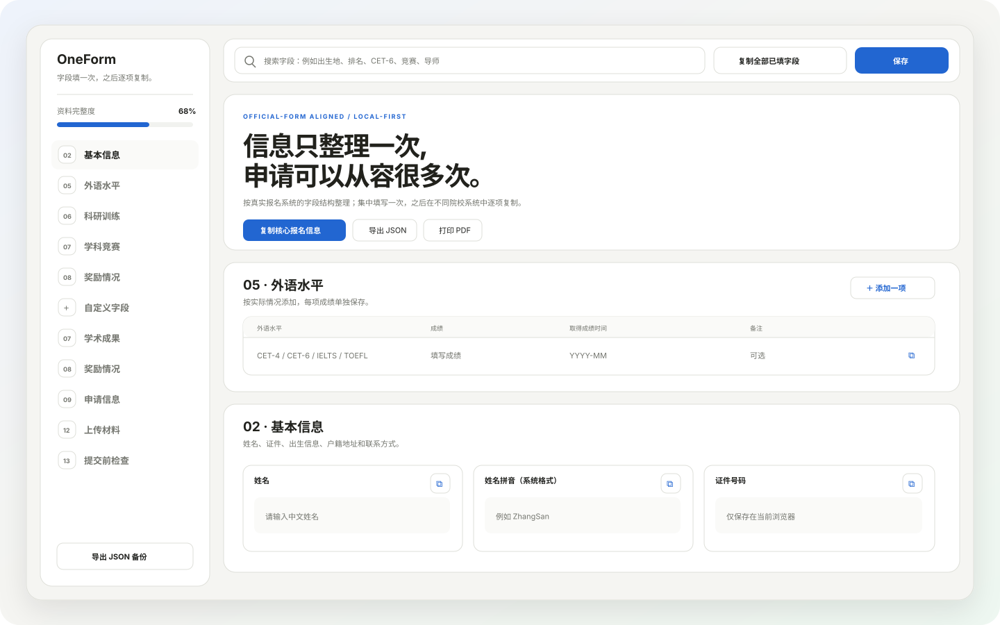
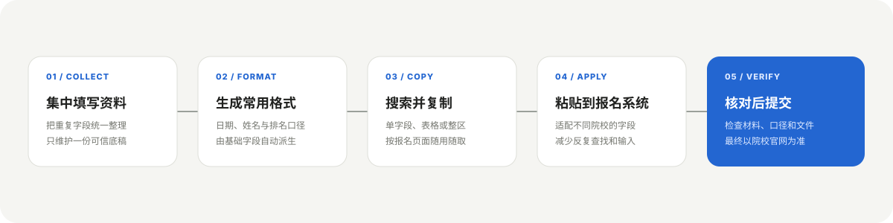

<div align="center">

# OneForm

**填写一次，随用随复制。**

一个本地优先、无需登录的推免报名信息底稿，帮助你集中维护重复字段，并在不同院校报名系统之间快速复制。


[在线使用](https://kirawii.github.io/OneForm/oneform.html) · [下载官网](https://kirawii.github.io/OneForm/) · [新手指引](USER_GUIDE.md) · [参与贡献](#参与贡献)

</div>



## 为什么做这个项目

推免报名系统的字段高度重复，但不同院校会使用不同的顺序、格式和命名。申请人往往需要在成绩单、证件、简历和历史表单之间反复查找，再将同一份信息录入多次。

本项目只解决一个核心问题：

> 建立一份可信的报名底稿，把信息填写一次，之后按需搜索、转换格式并复制。

## 功能特性

| 能力 | 说明 |
| --- | --- |
| 真实字段结构 | 按基本信息、家庭成员、学习信息、外语、实践、成果、奖励、申请、推荐人和材料等 13 个分区整理 |
| 快速复制 | 支持单字段、表格单元格、整张表格、整个分区及核心报名信息复制 |
| 格式派生 | 自动生成姓名、日期、排名等报名系统常用格式 |
| 全局搜索 | 按字段名称和已填写内容快速定位信息 |
| 本地保存 | 自动保存到当前浏览器的 `localStorage`，无需账号与服务器 |
| 备份迁移 | 支持明文 JSON 导入与导出 |
| 提交核对 | 内置材料清单、统一文件名建议和提交前检查 |
| 离线发行 | 构建为单个 HTML 文件，下载后即可离线打开 |
| 打印输出 | 提供适合打印或另存为 PDF 的页面样式 |

## 使用流程



## 快速开始

完全不懂代码也没关系，请直接阅读 [新手用户指引](USER_GUIDE.md)。其中只保留打开、填写、复制和备份四件事。

### 直接使用

1. 打开 [OneForm 官网](https://kirawii.github.io/OneForm/)。
2. 点击“在线使用”，或者下载离线版。
3. 填写资料；页面会自动保存到当前浏览器。
4. 遇到报名字段时，搜索对应信息并点击复制。

无需安装依赖，也不需要启动服务器。建议使用较新的 Chrome、Edge、Firefox 或 Safari 桌面浏览器。

> [!IMPORTANT]
> 公开发行版不会预填任何个人资料。浏览器存储与导出的 JSON 都是明文，请勿将真实资料提交到公开仓库、Issue 或聊天记录。

### 本地开发

需要 Node.js 20 或更高版本：

```bash
npm run check
```

该命令会：

1. 将 HTML、CSS 和 JavaScript 打包为单文件发行版；
2. 检查页面结构和关键功能入口；
3. 检查 13 个分区与 122 个资料字段是否完整；
4. 扫描公开文件中的已知私人内容。

也可以分别执行：

```bash
npm run build
npm test
```

## 项目结构

```text
.
├─ index.html                    # 页面结构与字段定义
├─ src/
│  ├─ styles.css                 # 视觉样式
│  └─ app.js                     # 保存、搜索、复制和导入导出
├─ scripts/
│  └─ build.mjs                  # 单文件构建脚本
├─ tests/
│  └─ static.test.mjs            # 结构、构建与隐私回归检查
├─ docs/
│  ├─ index.html                 # GitHub Pages 下载官网
│  ├─ guide.html                 # 面向普通用户的网页指引
│  ├─ site.css                   # 官网样式
│  ├─ oneform.html               # 官网在线版与下载文件
│  ├─ product-preview.svg        # README 产品预览
│  └─ workflow.svg               # README 工作流
├─ dist/
│  └─ oneform.html               # 可直接打开的发行文件
└─ _private/                     # 本机私人资料，已被 Git 忽略
```

项目使用原生 HTML、CSS 和 JavaScript，不包含运行时依赖。源码按结构、样式和逻辑拆分，发行时再合并为一个 HTML 文件。

## 数据与隐私

所有填写内容默认只保存在本机：

- 页面不会主动上传资料；
- 不包含账号系统、分析埋点、广告、CDN 或远程字体；
- `localStorage` 与 JSON 备份均为明文；
- “恢复初始模板”会清除本页面对应的本地资料；
- 院校要求和材料口径最终应以当年官方通知为准。

详细说明请阅读 [PRIVACY.md](PRIVACY.md) 和 [SECURITY.md](SECURITY.md)。

## 参与贡献

欢迎提交字段补充、兼容性修复、无障碍改进、文档完善和可复现的问题报告。

提交前请确认：

```bash
npm run check
```

贡献时请遵守以下原则：

- 不提交任何真实申请人的个人资料、截图或备份；
- 不将社区整理的字段描述为院校官方模板；
- 新功能应直接服务于“填写、查找、复制、备份或核对”；
- 保持原生技术栈和单文件离线发行能力；
- 修改字段后同步检查复制、搜索、导入导出和完成度统计。

完整规范见 [CONTRIBUTING.md](CONTRIBUTING.md)。

## 常见问题

<details>
<summary><strong>关闭页面后，资料还在吗？</strong></summary>

通常仍在。资料会保存在当前页面来源对应的浏览器 `localStorage` 中。但更换浏览器、移动文件位置、清理站点数据或使用隐私模式，都可能导致无法读取原数据。重要资料请及时导出 JSON 备份。

</details>

<details>
<summary><strong>可以把页面部署到网站吗？</strong></summary>

可以，但部署者必须保证发行文件未被篡改、未加入第三方脚本，并通过 HTTPS 提供页面。用户也应确认自己信任该托管方。

</details>

<details>
<summary><strong>字段与目标院校不完全一致怎么办？</strong></summary>

先使用搜索找到最接近的底稿字段，再按目标系统要求调整格式。项目提供的是资料整理工具，不替代目标院校当年的招生通知和报名说明。

</details>

## 许可证

本项目使用 [MIT License](LICENSE)。

---

如果这个项目帮助你减少了重复填表，欢迎通过 Issue、Pull Request 或文档改进参与维护。
